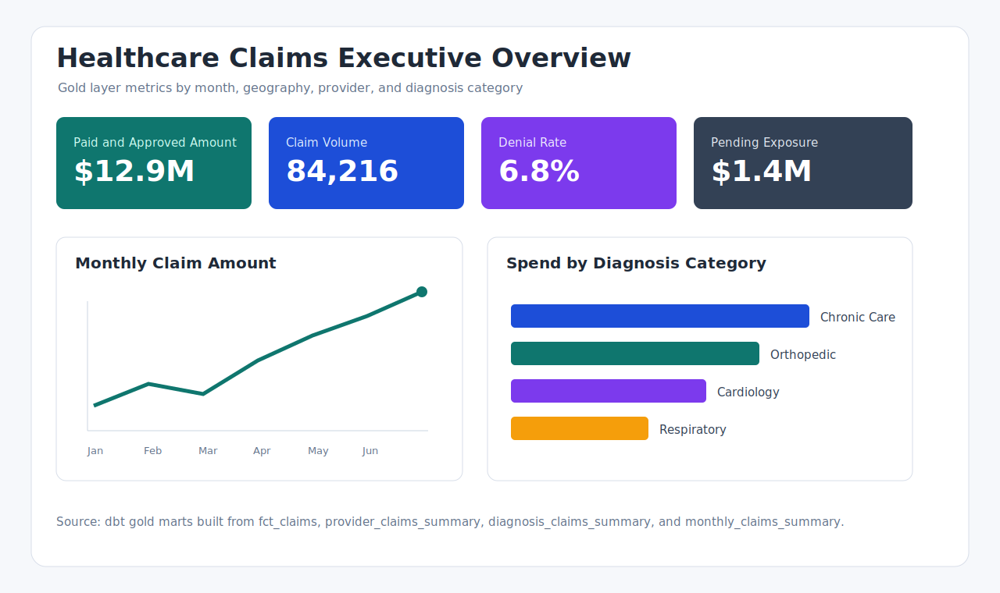
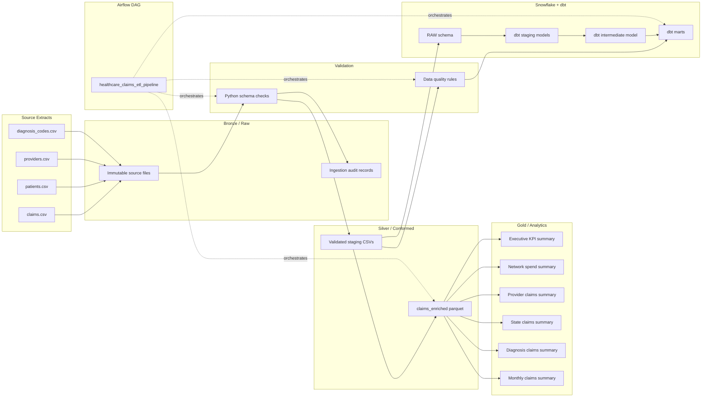
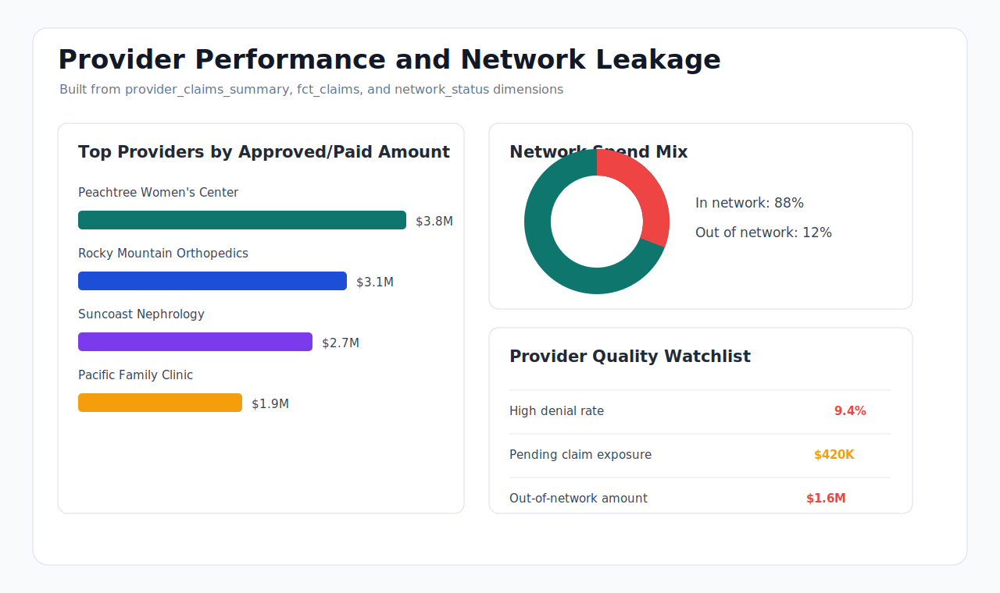

# Healthcare Claims ETL Pipeline

[](#tech-stack)
[](#tech-stack)
[](#tech-stack)
[](#dbt-and-snowflake)
[](.github/workflows/ci.yml)

Production-style healthcare claims analytics project built to demonstrate modern Data Engineering skills: Python, PySpark, Airflow, Snowflake, dbt, automated data quality checks, and dimensional reporting.

This project models a payer analytics workflow where raw claim extracts are validated, enriched, transformed through a medallion architecture, and published into BI-ready gold tables for cost, utilization, provider, diagnosis, geography, and trend reporting.



## Why This Project Matters

Healthcare payers rely on accurate claims data to monitor spend, reduce leakage, evaluate provider performance, and identify operational risk. A broken claim pipeline can create incorrect financial reporting, missed denial trends, and delayed business decisions.

This repository shows how I would build a small but realistic version of that system:

- Ingest raw CSV extracts with schema validation and audit metadata.
- Clean and standardize claim, patient, provider, and diagnosis reference data.
- Enforce data quality rules before analytics models are published.
- Use PySpark for scalable enrichment and aggregation.
- Model curated Snowflake tables with dbt tests and clear lineage.
- Orchestrate the end-to-end workflow with Airflow.

## Architecture



## Tech Stack

| Layer | Tools | What It Demonstrates |
| --- | --- | --- |
| Ingestion | Python, pandas | Schema validation, type normalization, deduplication, audit records |
| Processing | PySpark | Scalable joins, cleansing, medallion transformations, aggregations |
| Orchestration | Airflow | Task dependencies, retries, daily schedule, operational workflow |
| Warehouse | Snowflake | Raw, staging, intermediate, and analytics schema design |
| Modeling | dbt | Sources, staging models, intermediate joins, marts, tests |
| Testing | pytest, dbt tests | Unit tests, data quality rules, accepted values, relationships |
| DevOps | Docker Compose, GitHub Actions | Local Airflow runtime and lightweight CI |

## Business KPIs

The gold layer is designed to answer common payer analytics questions:

| KPI | Definition | Business Question |
| --- | --- | --- |
| Total paid and approved claim amount | Sum of claim_amount where claim_status is approved or paid | How much reimbursable spend is moving through the plan? |
| Claim volume | Count of distinct claim_id | Are claim submissions increasing by month, provider, or region? |
| Average claim amount | Total claim amount divided by claim count | Which providers or diagnosis categories drive higher unit cost? |
| Denial rate | Denied claims divided by total claims | Where are avoidable denials concentrated? |
| Pending exposure | Sum of pending claim amounts | What financial liability is not yet finalized? |
| Out-of-network spend | Approved or paid claim amount from out-of-network providers | How much leakage is occurring outside contracted networks? |
| Diagnosis category spend | Claim amount grouped by diagnosis_category | Which clinical categories drive the largest spend? |
| State-level spend | Claim amount grouped by claim_state | Which geographies need cost management attention? |

## Dashboard Mockups

The `screenshots/` folder contains BI-style mockups that show the intended consumption layer for the gold tables.



## Medallion Architecture

| Layer | Project Location | Purpose |
| --- | --- | --- |
| Bronze | `data/sample`, Snowflake `RAW` | Preserve source extracts and represent the raw operational feed. |
| Silver | `data/staging`, `data/silver`, dbt staging/intermediate models | Standardize types, remove invalid records, enrich claims with dimensions. |
| Gold | `data/gold`, dbt marts | Publish aggregated provider, state, diagnosis, and monthly reporting tables. |

More detail: [Medallion Architecture](docs/medallion_architecture.md)

## Data Quality Rules

Implemented in Python and dbt:

- `claim_id` cannot be null.
- `claim_id` must be unique.
- `claim_amount` must be numeric and positive.
- `claim_status` must be `approved`, `denied`, `pending`, or `paid`.
- `patient_id` must exist in the patient reference table.
- `provider_id` must exist in the provider reference table.
- `diagnosis_code` must exist in the diagnosis reference table.

## Data Model

```text
RAW.claims
RAW.patients
RAW.providers
RAW.diagnosis_codes
       |
       v
stg_claims / stg_patients / stg_providers / stg_diagnosis_codes
       |
       v
int_claims_enriched
       |
       v
fct_claims
claim_kpi_summary
network_claims_summary
provider_claims_summary
state_claims_summary
diagnosis_claims_summary
monthly_claims_summary
```

Snowflake documentation: [Schema Design](docs/snowflake_schema_design.md)

## Repository Structure

```text
healthcare-claims-etl-pipeline/
├── dags/                       Airflow DAG
├── src/                        Python ingestion, DQ, and PySpark jobs
├── dbt/                        Snowflake-targeted dbt project
├── data/sample/                Source CSV sample data
├── data/staging/               Generated validated CSVs
├── data/silver/                Generated enriched parquet layer
├── data/gold/                  Generated analytics parquet layer
├── data/audit/                 Generated ingestion audit records
├── docs/                       Architecture and warehouse documentation
├── screenshots/                Dashboard mockups
├── tests/                      pytest coverage
└── .github/workflows/          Lightweight CI
```

## How To Run Locally

Create a virtual environment and install dependencies:

```bash
python -m venv .venv
source .venv/bin/activate
pip install -r requirements.txt
```

Run ingestion and validation:

```bash
python src/ingest.py
python src/data_quality.py
pytest tests -q
```

Run Spark transformations:

```bash
spark-submit src/spark_transform.py
```

Start Airflow locally:

```bash
docker compose up airflow-init
docker compose up airflow-webserver airflow-scheduler
```

Open Airflow at `http://localhost:8080` and log in with `airflow` / `airflow`.

## dbt And Snowflake

Create Snowflake schemas and raw tables using:

```bash
docs/snowflake_setup.sql
```

Set environment variables:

```bash
export SNOWFLAKE_ACCOUNT="your_account"
export SNOWFLAKE_USER="your_user"
export SNOWFLAKE_PASSWORD="your_password"
export SNOWFLAKE_ROLE="TRANSFORMER"
export SNOWFLAKE_DATABASE="HEALTHCARE_CLAIMS"
export SNOWFLAKE_WAREHOUSE="COMPUTE_WH"
export SNOWFLAKE_SCHEMA="ANALYTICS"
```

Run dbt:

```bash
cd dbt
dbt debug --profiles-dir .
dbt run --profiles-dir .
dbt test --profiles-dir .
```

## Portfolio Business Impact

This project is framed around the type of data product a payer analytics team would use to improve claims visibility. The pipeline reduces manual spreadsheet work by standardizing the claim feed, catches bad records before they reach reporting, and produces reusable marts for finance, provider operations, and care management teams.

Example impact narrative:

- Finance can reconcile approved and paid claim exposure by month.
- Provider operations can identify high-cost providers and out-of-network leakage.
- Clinical analytics can monitor spend by diagnosis category.
- Data teams can trace each metric from dashboard mockup back to raw source fields and dbt tests.

## STAR Resume Bullets

- Situation: Healthcare claims data was split across claim, patient, provider, and diagnosis extracts. Task: Build a reliable analytics pipeline for payer reporting. Action: Developed Python ingestion, PySpark enrichment, Airflow orchestration, Snowflake schemas, and dbt marts. Result: Delivered reusable gold tables for provider, state, diagnosis, and monthly claims analysis.
- Situation: Claim reporting required trusted keys and valid financial values. Task: Prevent invalid records from reaching analytics. Action: Implemented schema validation, duplicate detection, accepted status checks, positive claim amount validation, and referential integrity checks. Result: Improved confidence in downstream claims KPIs and reduced manual QA effort.
- Situation: Business stakeholders needed visibility into cost drivers. Task: Create analytics-ready claim summaries. Action: Designed medallion architecture with Bronze, Silver, and Gold layers and built marts for provider performance, state trends, diagnosis spend, and monthly volume. Result: Enabled faster analysis of reimbursable spend, denial patterns, and regional utilization.
- Situation: The project needed to demonstrate production-style data engineering practices. Task: Make the pipeline understandable and maintainable. Action: Added dbt tests, pytest coverage, Docker-based Airflow execution, CI checks, warehouse documentation, and dashboard mockups. Result: Created a recruiter-ready portfolio project that communicates both engineering execution and business value.

## Original Resume Bullets

- Built end-to-end healthcare claims ETL pipeline using Python, PySpark, Airflow, Snowflake, and dbt.
- Designed medallion architecture with raw, silver, and gold layers for claims analytics.
- Implemented data quality checks for schema validation, duplicate detection, referential integrity, and claim amount validation.
- Developed dbt models for provider, diagnosis, state, and monthly claims reporting.

## Senior Data Engineer Review Notes

The repository has been reviewed for portfolio credibility. The current version avoids placeholder-only artifacts by including runnable ingestion, tests, dbt models, Snowflake DDL, audit records, medallion documentation, dashboard mockups, and business metric definitions. Generated runtime outputs are ignored so the repository remains clean when uploaded to GitHub.

## Documentation

- [Architecture](docs/architecture.md)
- [Business Metrics](docs/business_metrics.md)
- [Data Dictionary](docs/data_dictionary.md)
- [Medallion Architecture](docs/medallion_architecture.md)
- [Snowflake Schema Design](docs/snowflake_schema_design.md)
- [Snowflake Setup SQL](docs/snowflake_setup.sql)
