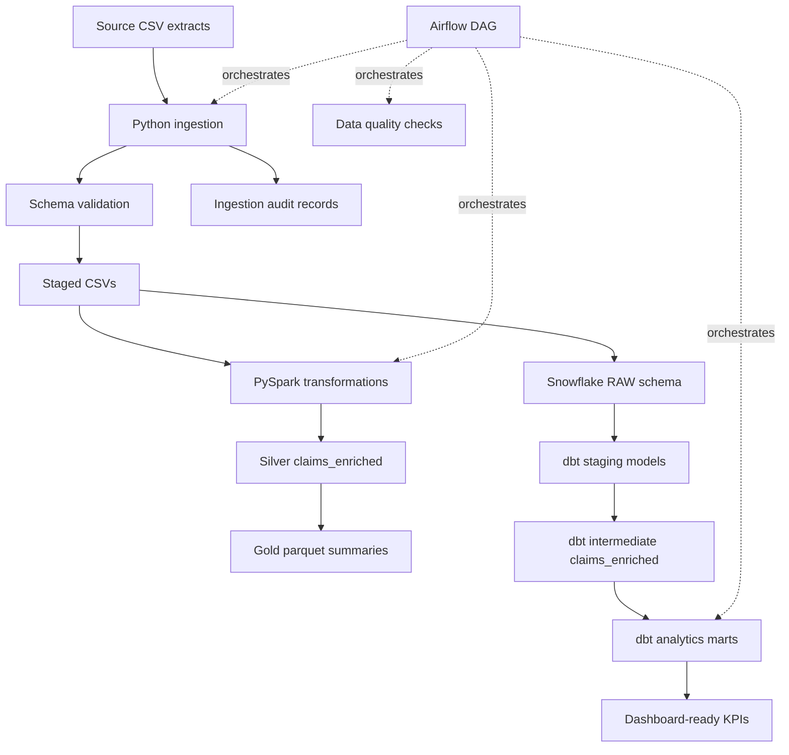

# Healthcare Claims ETL Architecture

This project simulates a payer claims analytics platform with clear separation between ingestion, validation, scalable processing, warehouse modeling, and analytics consumption.

## Design Principles

- Keep raw source structures available for replay and reconciliation.
- Validate required columns, key uniqueness, accepted status values, and reference integrity before publishing analytics.
- Use Spark for distributed joins and aggregates when claim volume grows beyond single-machine processing.
- Use dbt to make warehouse transformations testable, documented, and lineage-aware.
- Publish gold tables at grains that directly map to BI questions.

## Operational Flow

1. Airflow starts `ingest_raw_data`.
2. Python reads source CSVs, validates schemas, standardizes values, removes duplicate keys, and writes ingestion audit records.
3. PySpark reads staged files and creates silver enriched claims plus gold parquet summaries.
4. Data quality checks validate claim identifiers, amounts, statuses, and foreign keys.
5. dbt builds and tests Snowflake staging, intermediate, and analytics models.
6. The final publish task marks gold tables as ready for BI consumption.
